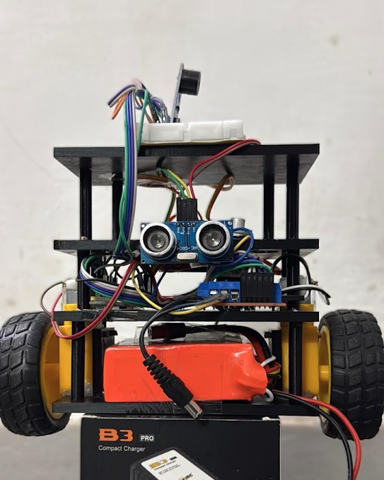
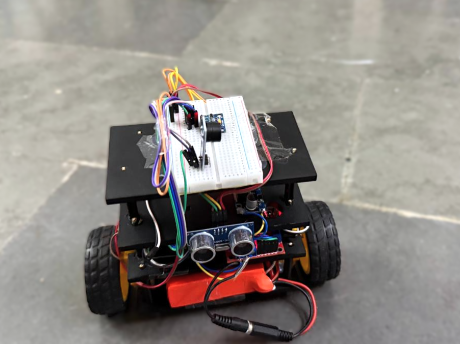
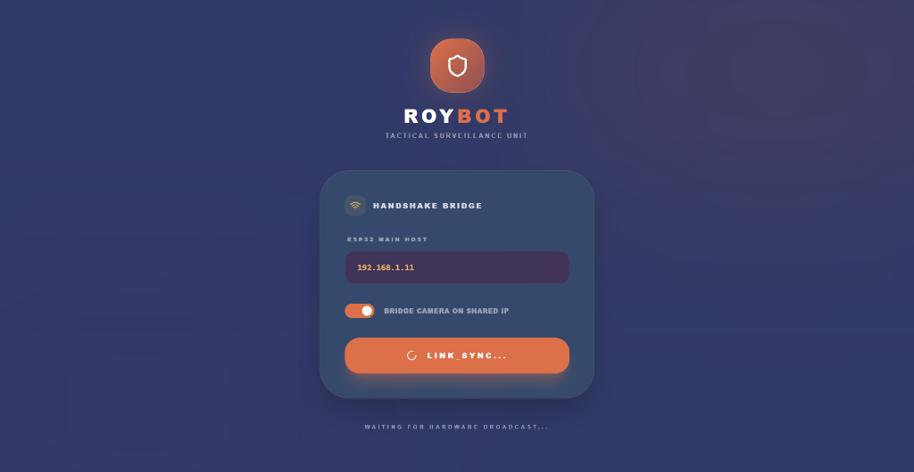
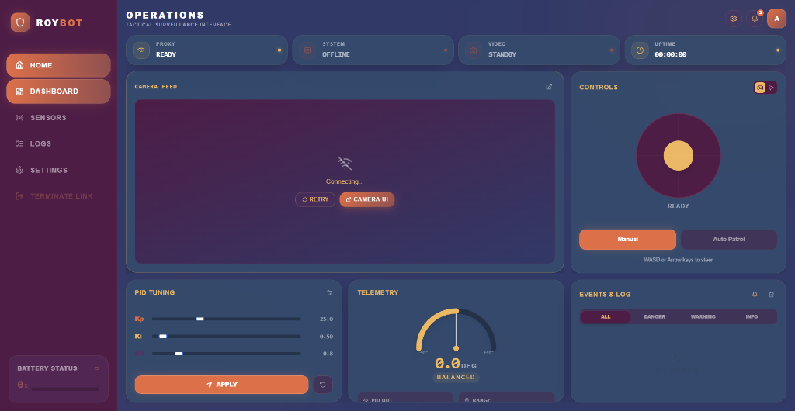

# ROYBOT 🤖
> **AI-Powered Self-Balancing Surveillance Robot Tactical Interface**

[](https://roybot-server.vercel.app/)
[](https://nextjs.org/)
[](https://www.typescriptlang.org/)
[](https://opensource.org/licenses/MIT)

ROYBOT is a high-performance, self-balancing surveillance robot featuring a real-time tactical dashboard. It merges advanced embedded systems (ESP32) with computer vision and a modern web stack to deliver a seamless, low-latency remote operation experience.

**🌐 Live Dashboard:** [https://roybot-server.vercel.app/](https://roybot-server.vercel.app/)

## 📸 Gallery

### Hardware Build
<p align="center">
  
  
</p>

### Tactical Web Dashboard
<p align="center">
  
  
</p>

---

## 🚀 Key Features

- **⚖️ Self-Balancing Core**: Precision PID control loop for stable, upright movement.
- **🎥 Tactical Video Feed**: Ultra-low latency MJPEG stream with integrated AI object detection.
- **🛡️ Industrial Dashboard**: A premium, dark-mode tactical interface built with Next.js 15 and Tailwind CSS.
- **📊 Real-time Telemetry**: Live tracking of Tilt Angle, Distance, PID Output, and System Uptime.
- **🕹️ Mission Control**: Full remote command support via WebSockets including manual drive and live PID tuning.
- **⚠️ Intelligent Alerts**: Automated system logging and obstacle detection warnings.

## 🛠️ Technology Stack

### Software Ecosystem
- **Frontend**: Next.js 15, React 19, TypeScript, Tailwind CSS, Lucide Icons.
- **Backend**: Node.js, Express, Socket.io for persistent real-time bi-directional communication.
- **Computer Vision**: TensorFlow.js (COCO-SSD) integrated directly into the browser.
- **Firmware**: C++ (Arduino/ESP32) optimized for real-time sensor fusion and motor control.

### Hardware Components
- **Main Brain**: ESP32 Dual-Core MCU.
- **Vision Unit**: ESP32-CAM (AI-Thinker).
- **Inertial Sensing**: MPU6050 (6-axis Gyroscope & Accelerometer).
- **Obstacle Detection**: HC-SR04 Ultrasonic Sensor.
- **Power Drive**: BTS7960 43A High-Power H-Bridge.

## 📦 Project Structure

```bash
├── client/          # Next.js 15 Tactical Dashboard (Frontend)
├── server/          # Node.js + Socket.io Proxy (Backend)
├── firmware/        # ESP32 & ESP32-CAM Source Code (C++)
└── vercel.json      # Vercel Deployment Configuration
```

## 🔧 Installation & Deployment

### 1. Firmware Configuration
- Flash `firmware/ROYBOT_Main.ino` to your primary ESP32.
- Flash `firmware/ROYBOT_Camera.ino` to the ESP32-CAM.
- The ESP32-CAM will automatically link to the `ROYBOT_AP` access point.

### 2. Backend Setup (Render/Railway/Local)
```bash
cd server
npm install
npm run dev
```
*Note: Ensure `CLIENT_URL` environment variable is set to your frontend domain.*

### 3. Frontend Setup (Vercel/Local)
```bash
cd client
npm install
npm run dev
```
*Note: Set `NEXT_PUBLIC_SERVER_URL` to your backend endpoint.*

## 📜 License
This project is licensed under the MIT License - see the [LICENSE](LICENSE) file for details.

## 🤝 Contributing
Contributions are what make the open-source community an amazing place to learn, inspire, and create. Any contributions you make are **greatly appreciated**.

---
*Developed with precision for the next generation of autonomous robotics.*
